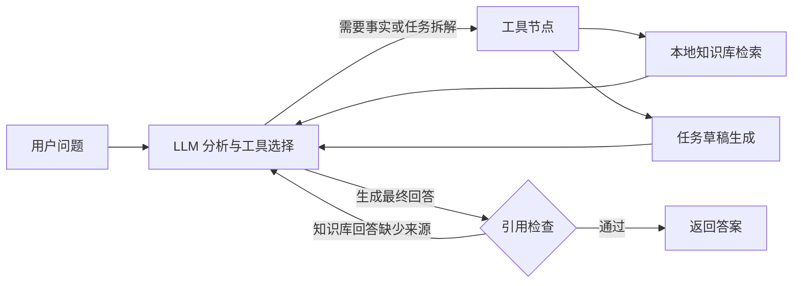

# 企业知识库与任务协同 Agent

这是一个基于 LangGraph 的中文企业 Agent 学习项目。它可以检索内部 Markdown
知识库、保留答案来源，并把自然语言需求整理成任务草稿。项目基于
[LangChain 官方 ReAct Agent 模板](https://github.com/langchain-ai/react-agent)
进行二次开发，保留 MIT 许可证。

> 当前为可测试的 V0.1。本仓库中的公司制度和数据均为虚构示例，不代表任何真实公司。

## 为什么做这个项目

普通聊天机器人可能直接根据模型记忆回答公司制度，容易产生无依据内容。本项目把
“模型思考”和“业务事实”分开：模型负责理解问题、选择工具和组织答案，知识库工具负责
返回事实和来源，LangGraph 负责控制工具循环和引用检查。

## 当前功能

- **中文企业知识库检索**：读取 `knowledge_base/` 下的 Markdown 文件，按章节切分并使用
  BM25 排序。
- **可追溯回答**：检索结果携带 `【来源：文件名#章节】`；引用检查节点会要求模型补充
  遗漏的来源。
- **任务草稿生成**：把目标整理为负责人、截止时间、验收标准和执行步骤；不会向外部
  系统提交数据。
- **模型可替换**：默认配置通义千问的 OpenAI 兼容接口，也可改用 DeepSeek 等模型。
- **离线单元测试**：检索、工具、条件路由和引用检查无需 API Key 即可验证。

## 系统流程



这条图对应 `src/enterprise_agent/graph.py`：`call_model` 负责模型调用，`tools`
执行工具，`citation_guard` 检查知识库回答是否保留来源。检查最多触发一次，避免死循环。

## 项目结构

```text
enterprise-knowledge-agent/
├── knowledge_base/                 # 中文 Markdown 示例知识库
├── src/enterprise_agent/
│   ├── context.py                  # 模型与公司名称配置
│   ├── graph.py                    # LangGraph 工作流和引用检查
│   ├── knowledge_base.py           # Markdown 切分与 BM25 检索
│   ├── prompts.py                  # 中文系统提示词
│   ├── state.py                    # 会话状态
│   ├── tools.py                    # 知识检索与任务草稿工具
│   └── utils.py                    # 模型加载和消息处理
├── tests/                          # 离线单元测试与可选集成测试
├── .env.example                    # 环境变量示例
└── langgraph.json                  # LangGraph 启动入口
```

## 本地运行

### 1. 准备环境

- Python 3.11 或更高版本
- 推荐安装 [uv](https://docs.astral.sh/uv/)
- 一个支持工具调用的模型 API Key

### 2. 安装依赖

```bash
uv sync --dev
```

### 3. 配置模型

复制 `.env.example` 为 `.env`，然后填入自己的密钥。不要把 `.env` 提交到 GitHub。

通义千问示例：

```dotenv
MODEL=openai/qwen-plus
OPENAI_API_KEY=你的密钥
OPENAI_BASE_URL=https://dashscope.aliyuncs.com/compatible-mode/v1
COMPANY_NAME=示例科技公司
```

DeepSeek 示例：

```dotenv
MODEL=openai/deepseek-chat
OPENAI_API_KEY=你的密钥
OPENAI_BASE_URL=https://api.deepseek.com
COMPANY_NAME=示例科技公司
```

### 4. 运行测试

```bash
uv run pytest tests/unit_tests -q
```

单元测试不会调用模型，也不会产生 API 费用。配置好密钥后，可执行真实对话测试：

没有 API Key 时也可以先查看两个工具的真实输出：

```bash
uv run python scripts/demo_without_llm.py
```

配置好密钥后，可执行真实对话测试：

PowerShell：

```powershell
$env:RUN_INTEGRATION_TESTS="1"
uv run pytest tests/integration_tests -q
```

Bash：

```bash
RUN_INTEGRATION_TESTS=1 uv run pytest tests/integration_tests -q
```

### 5. 启动 LangGraph 开发服务

```bash
uv run langgraph dev
```

启动后可以尝试：

- `出差回来后最晚什么时候提交报销，需要哪些材料？`
- `我忘记打卡了，应该怎样处理？`
- `把“本周整理客户高频问题”拆成一份任务草稿。`
- `公司的年终奖规则是什么？`（知识库没有依据时，应拒绝编造）

## 怎样替换成自己的知识库

1. 删除 `knowledge_base/` 下的虚构示例文件。
2. 按“一个主题一个 Markdown 文件”的方式放入自己的脱敏资料。
3. 一级标题写文档名称，二级标题写可引用章节。
4. 重启开发服务后，索引会重新加载。

不要把真实客户数据、密码、API Key 或未经授权的公司内部文件提交到公开仓库。

## 我完成的二次开发

相对于官方 ReAct 模板，本项目完成了以下改造：

1. 把单一联网搜索工具替换为企业知识库检索和任务草稿工具。
2. 实现中文 Markdown 章节切分，以及不依赖外部数据库的 BM25 检索。
3. 为检索结果设计统一来源标记，增加 LangGraph 引用检查节点。
4. 支持通义千问、DeepSeek 等 OpenAI 兼容模型端点。
5. 增加虚构企业资料、离线测试、中文运行文档和系统流程图。

## 下一步计划

- V0.2：支持 PDF 和 Word 导入、文本清洗与增量索引。
- V0.3：加入向量检索和 BM25 混合召回，对比不同检索策略。
- V0.4：保存多轮会话并增加人工确认节点。
- V0.5：提供简单 Web 页面和 20 条评测数据集。

## 面试讲解提纲

**项目目标**：让模型只依据企业资料回答制度问题，并能生成可执行任务草稿。

**核心设计**：LLM 不直接保存业务事实，而是通过 Tool Calling 查询知识库；LangGraph
负责 ReAct 循环，最终答案进入引用检查节点，缺少来源时再修正一次。

**我解决的问题**：

- 中文不能只按空格分词，因此检索层同时生成单字和双字 token。
- 每个 Markdown 二级标题单独成为检索块，答案可以精确引用到章节。
- 任务工具只返回 `draft`，避免模型误称已经创建或审批任务。
- 将模型相关集成测试与离线单元测试分开，避免每次测试都调用付费接口。

**当前限制**：V0.1 只支持 Markdown 和 BM25，尚未接入向量数据库；示例知识库是虚构
数据。回答质量仍受模型工具调用能力影响。

## License 与致谢

本项目遵循 [MIT License](LICENSE)。初始结构来自 LangChain 官方
`react-agent` 模板，二次开发时保留了原许可证和来源说明。
